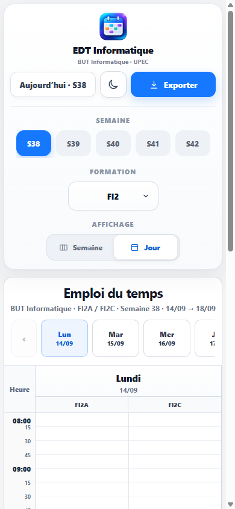
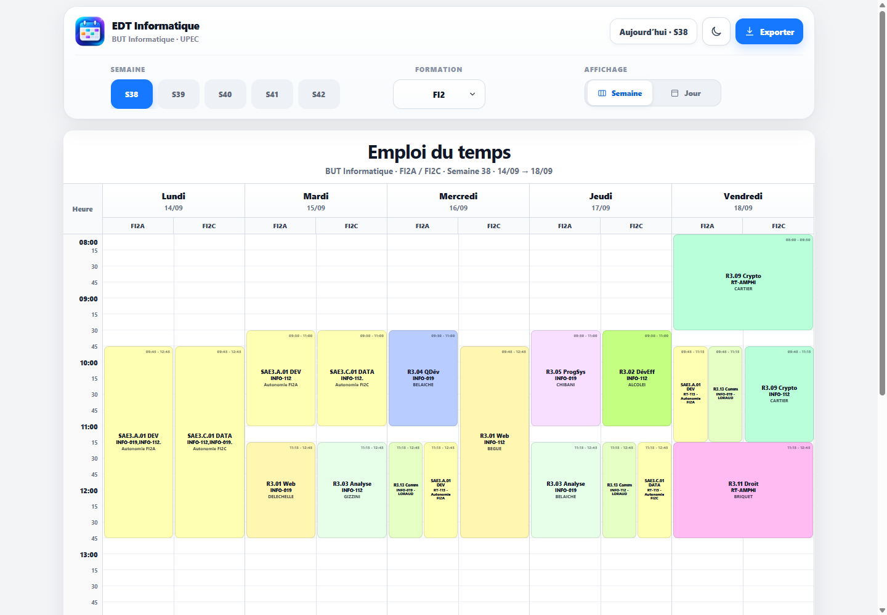

# EDT Informatique UPEC

<p align="center">
  
</p>

Application web responsive destinée à consulter les emplois du temps du BUT Informatique de l'UPEC. Elle transforme les données publiées sur Formadep360 en fichiers JSON exploitables par une interface claire, rapide et adaptée aussi bien au mobile qu'à l'ordinateur.

L'objectif est de proposer une lecture plus pratique qu'un tableau horizontal classique, en particulier avec une vue quotidienne verticale sur petit écran.

## Fonctionnalités

- Consultation des emplois du temps FI2 et FA2.
- Affichage des groupes A, C et des cours communs.
- Vue Semaine pour comparer l'ensemble des cours et vue Jour verticale pour le mobile.
- Navigation entre les semaines et les jours.
- Sélection automatique de la semaine correspondant à la date courante.
- Passage manuel à une autre semaine sans rechargement de page.
- Synchronisation des données depuis Formadep360 vers des fichiers JSON.
- Mode clair et sombre, mémorisé localement.
- Interface responsive pour smartphone, tablette et ordinateur.
- Export de l'emploi du temps affiché au format PNG.
- Navigation tactile par balayage et navigation au clavier dans la vue Jour.

## Aperçu

### Vue Jour sur mobile



### Vue Semaine sur écran large



## Fonctionnement

```text
Formadep360
  |
  v
Scripts Python de synchronisation
  |
  +--> public_html/data/edt.json  (FI2)
  |
  +--> public_html/data/fa2.json  (FA2)
  |
  v
Application web HTML, CSS et JavaScript
```

Les scripts récupèrent les semaines disponibles, lisent les cours et normalisent les informations utiles : date, groupe, matière, salle, enseignant, type de séance et horaires. L'interface charge ensuite les fichiers JSON localement.

## Technologies

| Domaine | Technologies |
| --- | --- |
| Interface | HTML5, CSS3, JavaScript vanilla |
| Données | JSON, LocalStorage |
| Synchronisation | Python 3, Requests, BeautifulSoup4 |
| Export | html2canvas |
| Hébergement compatible | Apache, PHP |

## Structure du projet

```text
public_html/
  assets/                 Images et icônes de l'application
  css/style.css           Styles et comportements responsives
  data/                   Emplois du temps FI2 et FA2 au format JSON
  js/app.js               Interface, navigation, thème et export
  index.html              Point d'entrée de l'application
  cron-sync.php           Déclencheur HTTP protégé pour la synchronisation FI2
sync/
  formadep_sync.py        Synchronisation FI2
  formadep_sync_fa2.py    Synchronisation FA2
  run_sync.bat            Synchronisation des deux formations sous Windows
  run_sync.sh             Synchronisation des deux formations sous Linux/macOS
docs/
  DEPLOYMENT.md           Notes de déploiement
  screenshots/            Captures de l'interface
```

## Lancer le projet localement

L'interface peut être consultée avec les fichiers JSON déjà présents dans le dépôt.

```bash
python -m http.server 8080 -d public_html
```

Ouvrir ensuite <http://localhost:8080>.

## Mettre à jour les données

Créer un environnement Python puis installer les dépendances :

```bash
python -m venv .venv
```

Sous Windows :

```powershell
.\.venv\Scripts\Activate.ps1
pip install -r sync\requirements.txt
.\sync\run_sync.bat
```

Sous Linux ou macOS :

```bash
source .venv/bin/activate
pip install -r sync/requirements.txt
./sync/run_sync.sh
```

Les commandes ci-dessus actualisent `public_html/data/edt.json` et `public_html/data/fa2.json` avec les semaines disponibles.

## Données et sécurité

Les données affichées proviennent de Formadep360. Aucun identifiant personnel, mot de passe ou secret de production n'est conservé dans le dépôt.

Le déclencheur de synchronisation HTTP prévu pour un hébergement lit son secret depuis un fichier local ignoré par Git. Les détails techniques sont documentés dans [docs/DEPLOYMENT.md](docs/DEPLOYMENT.md).

## Auteur

Yassine Wasel, étudiant en BUT Informatique à l'UPEC.

## Licence

Ce projet est distribué sous licence MIT. Voir [LICENSE](LICENSE).
